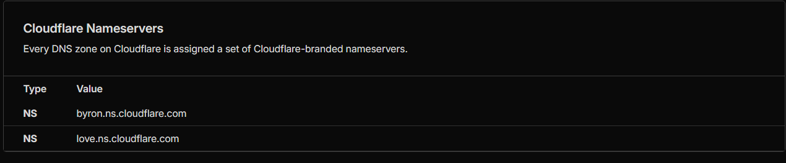
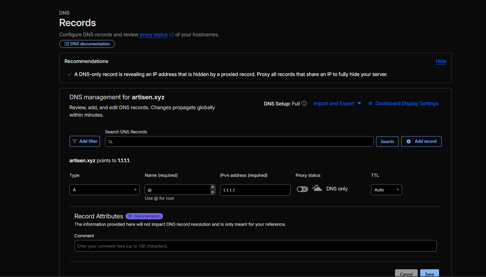
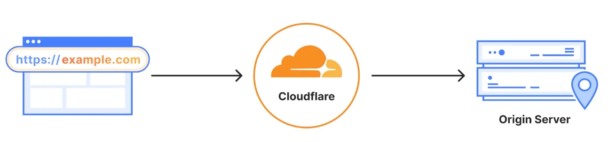
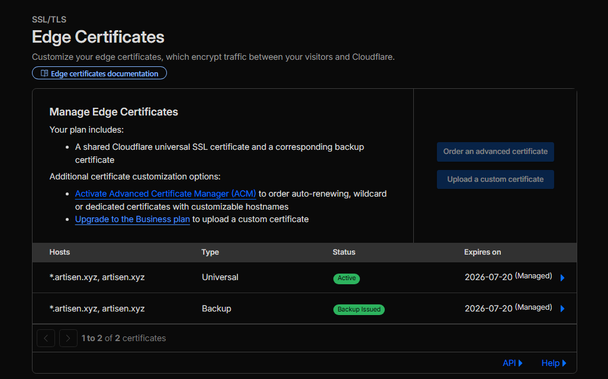
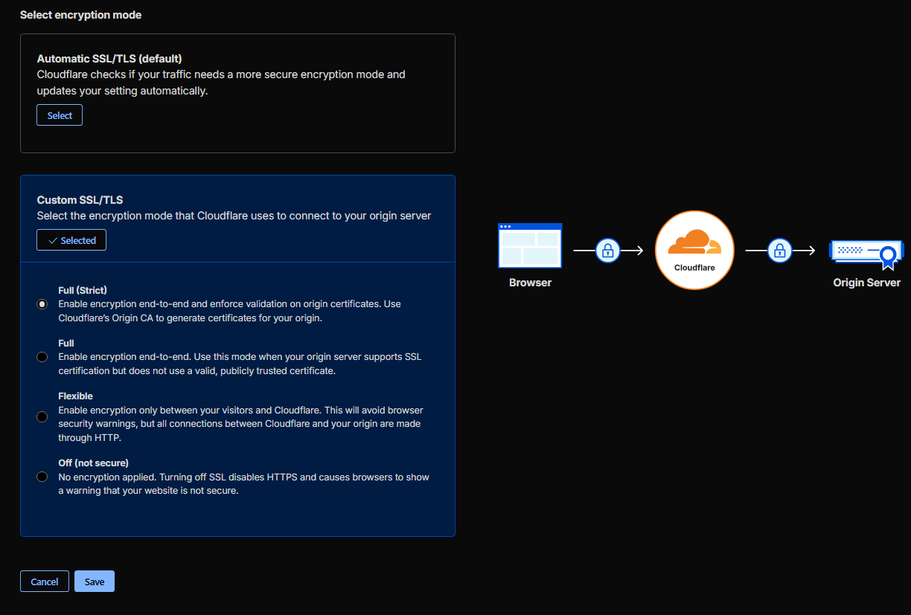

# How to Use Cloudflare: DNS Records & SSL Setup

A practical guide to managing your domain's DNS and enabling SSL/HTTPS through Cloudflare.

> **Screenshots:** Create an `images/` folder next to this file and save your 5 screenshots using the filenames listed below. They will appear automatically in the guide.

---

## Table of Contents

1. [Getting Started](#getting-started)
2. [Adding Your Domain to Cloudflare](#adding-your-domain-to-cloudflare)
3. [Understanding DNS Records](#understanding-dns-records)
4. [Adding & Managing DNS Records](#adding--managing-dns-records)
5. [Enabling SSL/TLS (HTTPS)](#enabling-ssltls-https)
6. [SSL Modes Explained](#ssl-modes-explained)
7. [Force HTTPS Redirect](#force-https-redirect)
8. [Common Setups](#common-setups)
9. [Troubleshooting](#troubleshooting)

---

## Getting Started

### What You Need

- A domain name (bought from any registrar — GoDaddy, Namecheap, Google Domains, etc.)
- A free Cloudflare account at [cloudflare.com](https://cloudflare.com)

### How Cloudflare Works

When you add your domain to Cloudflare, you point your domain's **nameservers** to Cloudflare. From that point on, Cloudflare controls your DNS and acts as a proxy between visitors and your server.

```
Visitor → Cloudflare (DNS + SSL + Proxy) → Your Server
```

---

## Adding Your Domain to Cloudflare

1. Log in to your Cloudflare dashboard
2. Click **"Add a domain"**
3. Enter your domain name (e.g., `example.com`) and click **Continue**

4. Choose a plan — the **Free plan** includes DNS, SSL, and basic protection
5. Cloudflare scans your existing DNS records and imports them
6. Review the imported records, then click **Continue**
7. Cloudflare gives you **two nameservers**, for example:
   ```
   ada.ns.cloudflare.com
   bob.ns.cloudflare.com
   ```

   

8. Go to your domain registrar and replace the existing nameservers with Cloudflare's
9. Click **Done** — propagation takes between a few minutes and 48 hours

> **Tip:** You can check propagation status at [whatsmydns.net](https://whatsmydns.net)

---

## Understanding DNS Records

These are the most common DNS record types you'll work with in Cloudflare:

| Type  | Purpose                                      | Example Value              |
|-------|----------------------------------------------|----------------------------|
| **A**     | Points domain to an IPv4 address         | `203.0.113.10`             |
| **AAAA**  | Points domain to an IPv6 address         | `2001:db8::1`              |
| **CNAME** | Alias — points to another domain name    | `myapp.netlify.app`        |
| **MX**    | Mail server routing                      | `mail.example.com`         |
| **TXT**   | Verification & SPF/DKIM records          | `v=spf1 include:... ~all`  |
| **NS**    | Nameserver delegation                    | `ada.ns.cloudflare.com`    |
| **SRV**   | Service location (e.g., for gaming/VoIP) | `_service._tcp.example.com`|

---

## Adding & Managing DNS Records

### How to Add a Record

1. Go to your domain in the Cloudflare dashboard
2. Click **DNS** → **Records** in the left sidebar
3. Click **Add record**
4. Fill in the fields:
   - **Type** — select record type (A, CNAME, MX, etc.)
   - **Name** — the subdomain or `@` for the root domain
   - **Content** — the IP address or target hostname
   - **Proxy status** — orange cloud (proxied) or grey cloud (DNS only)
   - **TTL** — how long DNS resolvers cache the record (Auto when proxied)

   

5. Click **Save**

---

### Common Record Examples

#### Point root domain to a server (A record)
```
Type:    A
Name:    @
Content: 203.0.113.10
Proxy:   Proxied (orange cloud)
TTL:     Auto
```

#### Point www subdomain to root (CNAME)
```
Type:    CNAME
Name:    www
Content: example.com
Proxy:   Proxied (orange cloud)
TTL:     Auto
```

#### Point subdomain to an external host (CNAME)
```
Type:    CNAME
Name:    blog
Content: mysite.ghost.io
Proxy:   DNS only (grey cloud)
TTL:     Auto
```

#### Add a mail server (MX record)
```
Type:     MX
Name:     @
Content:  mail.example.com
Priority: 10
TTL:      Auto
```

#### Domain verification (TXT record)
```
Type:    TXT
Name:    @
Content: google-site-verification=xxxxxxxxxxxxx
TTL:     Auto
```

---

### Proxy Status: Orange Cloud vs Grey Cloud



| | Orange Cloud (Proxied) | Grey Cloud (DNS Only) |
|---|---|---|
| Traffic routed through Cloudflare | Yes | No |
| SSL from Cloudflare | Yes | No |
| DDoS protection | Yes | No |
| Your server IP hidden | Yes | No |
| Use when | Web traffic (HTTP/HTTPS) | Mail, FTP, non-web services |

> **Important:** MX, TXT, and NS records cannot be proxied — they are always DNS only.

---

## Enabling SSL/TLS (HTTPS)

Cloudflare provides free SSL certificates automatically when you proxy traffic through them.

### Step 1 — Choose Your SSL Mode

1. In your Cloudflare dashboard, go to **SSL/TLS** → **Overview**
2. Select the appropriate mode (see [SSL Modes](#ssl-modes-explained) below)

### Step 2 — Enable Automatic HTTPS Rewrites

1. Go to **SSL/TLS** → **Edge Certificates**
2. Toggle on **Automatic HTTPS Rewrites**

This rewrites mixed-content HTTP links on your page to HTTPS automatically.

### Step 3 — Enable Always Use HTTPS

1. Still on **SSL/TLS** → **Edge Certificates**
2. Toggle on **Always Use HTTPS**

   

This redirects all HTTP visitors to HTTPS.

---

## SSL Modes Explained

Cloudflare offers four SSL/TLS encryption modes. Choose based on your server setup:



### Off
- No encryption between visitor and Cloudflare, or Cloudflare and server
- **Do not use this**

### Flexible
```
Visitor ←HTTPS→ Cloudflare ←HTTP→ Your Server
```
- Cloudflare encrypts traffic from visitors but connects to your server over plain HTTP
- Use only if your server has **no SSL certificate at all**
- Not recommended — your server-side traffic is unencrypted

### Full
```
Visitor ←HTTPS→ Cloudflare ←HTTPS→ Your Server
```
- Cloudflare encrypts both sides
- Your server needs an SSL certificate, but it **can be self-signed**
- Good for most setups

### Full (Strict) — Recommended
```
Visitor ←HTTPS→ Cloudflare ←HTTPS→ Your Server (valid cert)
```
- Same as Full, but Cloudflare **verifies** your server's certificate is valid and trusted
- Your server needs a certificate from a trusted CA (e.g., Let's Encrypt)
- Most secure option

> **Recommendation:** Use **Full (Strict)** if your server has a valid SSL certificate (e.g., via Let's Encrypt). Use **Full** if you have a self-signed cert. Avoid **Flexible** in production.

---

## Force HTTPS Redirect

To ensure all traffic uses HTTPS:

### Method 1 — Always Use HTTPS (simplest)
1. **SSL/TLS** → **Edge Certificates**
2. Toggle **Always Use HTTPS** → On

### Method 2 — Page Rule (more control)
1. Go to **Rules** → **Page Rules**
2. Click **Create Page Rule**
3. Set URL pattern: `http://example.com/*`
4. Add setting: **Always Use HTTPS**
5. Click **Save and Deploy**

### Method 3 — Redirect Rule
1. Go to **Rules** → **Redirect Rules**
2. Click **Create rule**
3. Set condition: `Scheme equals http`
4. Set redirect to: `https://${http.host}${http.request.uri.path}`
5. Select **301 (Permanent Redirect)**
6. Save and deploy

---

## Common Setups

### Static Site (GitHub Pages, Netlify, Vercel)

```
Type:    CNAME
Name:    @
Content: your-site.netlify.app    (or pages.github.com / vercel.app)
Proxy:   Proxied
```

```
SSL/TLS Mode: Full
Always Use HTTPS: On
```

---

### VPS / Dedicated Server (with Let's Encrypt)

```
Type:    A
Name:    @
Content: YOUR_SERVER_IP
Proxy:   Proxied
```

```
SSL/TLS Mode: Full (Strict)
Always Use HTTPS: On
```

Install Let's Encrypt on your server:
```bash
sudo apt install certbot python3-certbot-nginx
sudo certbot --nginx -d example.com -d www.example.com
```

---

### Email Setup (Google Workspace / Zoho / Custom)

```
Type:     MX      Name: @    Content: smtp.google.com   Priority: 1
Type:     TXT     Name: @    Content: v=spf1 include:_spf.google.com ~all
Type:     CNAME   Name: mail Content: ghs.google.com
```

> Keep email records as **DNS only (grey cloud)** — do not proxy MX records.

---

## Troubleshooting

### SSL certificate errors after switching to Cloudflare

- Wait up to 24 hours for the certificate to fully provision
- Check **SSL/TLS** → **Edge Certificates** for the certificate status
- If using **Full (Strict)** and getting errors, temporarily switch to **Full** to verify your server cert is the issue

### ERR_TOO_MANY_REDIRECTS

This usually means a redirect loop:
- Set SSL mode to **Full** or **Full (Strict)** (not Flexible)
- Disable "Always Use HTTPS" in your server config if Cloudflare already handles it

### DNS changes not taking effect

- Check if old records are cached: use `nslookup example.com 8.8.8.8`
- DNS propagation can take up to 48 hours globally
- Try flushing local DNS cache:
  ```bash
  # Windows
  ipconfig /flushdns

  # macOS
  sudo dscacheutil -flushcache; sudo killall -HUP mDNSResponder

  # Linux
  sudo systemd-resolve --flush-caches
  ```

### Record not showing after adding

- Cloudflare caches for a short period — wait 1–2 minutes and refresh
- Make sure TTL is set to Auto for proxied records

---

## Quick Reference

| Task | Where to find it |
|------|-----------------|
| Add/edit DNS records | DNS → Records |
| Change SSL mode | SSL/TLS → Overview |
| Force HTTPS | SSL/TLS → Edge Certificates → Always Use HTTPS |
| Create redirect rule | Rules → Redirect Rules |
| Check certificate status | SSL/TLS → Edge Certificates |
| View nameservers | DNS → Records (scroll to bottom) |
| Pause Cloudflare proxy | Overview → Advanced Actions → Pause |

---

*Last updated: April 2026*
